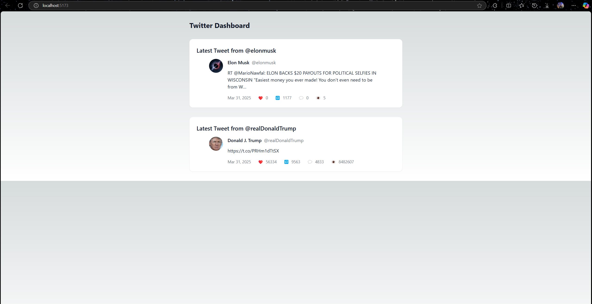

# Social Media Analysis Dashboard 🚀


</img> </img> </img>

A real-time social media analytics dashboard that displays and analyzes content from multiple platforms, starting with Twitter API integration.

</img>

## ✨ Features

### Current Implementation (App still in progress)
- 🐦 Real-time Twitter feed from selected accounts (@elonmusk, @realDonaldTrump)
- 📊 Basic tweet metrics (likes, retweets, engagement)
- 💾 Supabase PostgreSQL caching layer
- ⚡ Edge Functions for API processing
- � Responsive Vue.js frontend with Tailwind CSS

### Planned Enhancements
- 📈 Sentiment analysis for tweets
- 🔍 Multi-platform integration (Instagram, Facebook, Reddit)
- 🗂️ User-defined account lists
- 📉 Advanced analytics dashboard
- 🔔 Custom notifications for important posts

## 🛠️ Tech Stack

**Frontend**
- Vue 3 (Composition API)
- Tailwind CSS
- Vue Toastification

**Backend**
- Supabase Edge Functions (Deno)
- Twitter API v2

**Database**
- Supabase PostgreSQL
- Row-level security enabled

**DevOps**
- GitHub Actions (CI/CD)
- Supabase Migrations

## 📂 Project Structure

```bash
twitter-dashboard/
├── src/
│   ├── assets/               # Static assets
│   ├── components/           # Vue components
│   │   ├── TweetCard.vue     # Individual tweet display
│   │   └── Analytics.vue     # (Planned) Metrics visualization
│   ├── composables/          # Vue composables
│   │   └── useTweets.js      # Tweet data logic
│   ├── stores/               # Pinia stores
│   │   └── tweets.js         # State management
│   └── views/                # Page components
│       └── Dashboard.vue     # Main view
├── supabase/
│   ├── migrations/           # Database migrations
│   └── functions/            # Edge Functions
│       └── twitter-fetch/    # Twitter API handler
└── tests/                    # (Planned) Test directory

```
🚀 Getting Started
Prerequisites
Node.js v16+

Supabase account

Twitter Developer account

Git

Installation
Clone the repo:

bash
Copy
git clone https://github.com/yourusername/social-media-analytics.git
cd social-media-analytics
Install dependencies:

bash
Copy
npm install
Set up environment variables:

bash
Copy
cp .env.example .env
Edit .env with your credentials.

Database setup:

bash
Copy
supabase start
supabase migration up
Deploy Edge Functions:

bash
Copy
supabase functions deploy twitter-fetch --no-verify-jwt
Run the development server:

bash
Copy
npm run dev
🔧 Database Schema
sql
Copy
CREATE TABLE tweets (
  id BIGINT PRIMARY KEY,
  content TEXT NOT NULL,
  created_at TIMESTAMPTZ NOT NULL,
  author_id TEXT NOT NULL,
  author_name TEXT NOT NULL,
  author_handle TEXT NOT NULL,
  author_image TEXT,
  likes INT DEFAULT 0,
  retweets INT DEFAULT 0,
  replies INT DEFAULT 0,
  sentiment_score FLOAT, -- Planned for sentiment analysis
  platform TEXT DEFAULT 'twitter',
  raw_data JSONB -- Full API response storage
);

CREATE INDEX idx_tweets_author ON tweets(author_id);
CREATE INDEX idx_tweets_timestamp ON tweets(created_at);
🤝 How to Contribute
I welcome contributions! Here's how:

Fork the project

Create your feature branch (git checkout -b feature/AmazingFeature)

Commit your changes (git commit -m 'Add some AmazingFeature')

Push to the branch (git push origin feature/AmazingFeature)

Open a Pull Request

Good First Issues
Add loading skeletons

Implement dark mode toggle

Add unit tests with Vitest

📜 License
Distributed under the MIT License. See LICENSE for more information.

📬 Contact
Tamim GOLAM - golam.tamim94@gmail.com
Karl Marvensky JOISSAINT 
Jean-Pierre TRAN 

Project Link: https://github.com/tamim94/social-media-analytics

🙏 Acknowledgments
Vue.js and Supabase communities

Twitter API documentation


