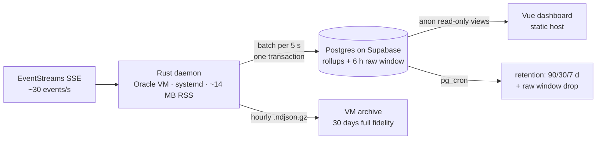

# wikistream 🌊

[](https://github.com/Tamim94/Wikistream/actions/workflows/ci.yml)
**[🔴 LIVE DEMO](https://wikistream.golam-tamim94.workers.dev/)**

Live analytics over **Wikimedia's global edit stream** — every edit, on every wiki, as it happens.

A Rust daemon consumes the [EventStreams](https://wikitech.wikimedia.org/wiki/EventStreams) firehose
(~30 edits/second, worldwide, ~2.6 M events/day) and rolls it up into Postgres: minute/hour/day
buckets, HyperLogLog unique-editor estimates, and a durable cursor with honest gap accounting —
holding **90 days of queryable history inside a 500 MB free tier**. A Vue dashboard reads the rollups.

> Raw, that stream is ~3.8 GB/day. The database budget is 500 MB. That constraint is the project:
> nothing about the storage design is optional.

## Architecture


```mermaid
flowchart LR
    A[EventStreams SSE<br/>~30 events/s] --> B[Rust daemon<br/>Oracle VM · systemd · ~14 MB RSS]
    B -->|batch per 5 s<br/>one transaction| C[(Postgres on Supabase<br/>rollups + 6 h raw window)]
    B -->|hourly .ndjson.gz| D[VM archive<br/>30 days full fidelity]
    C -->|anon read-only views| E[Vue dashboard<br/>static host]
    C -->|pg_cron| F[retention: 90/30/7 d<br/>+ raw window drop]
```

## The numbers

Measured from the running system, updated as it accumulates — not aspirational:

| Metric | Value | Source |
|---|---|---|
| Ingest rate | ~28–33 events/s | daemon stats (journald) |
| Daemon memory | ~13–14 MB RSS, flat | /proc/self/statm |
| Uptime | *accumulating* | systemd + external witness |
| DB size | ~200 MB of 500 MB at steady state (raw 6 h window dominates) | `pg_database_size` |
| Recorded gaps | 0 | `ingest_gaps` (loss only — see ADR 0003) |
| Editor estimates | HLL p=12 (~1.6% typical error) | daemon-computed, labeled as estimates |

## How it works

1. **Ingest** — the daemon tails `mediawiki.recentchange` (SSE). Wikimedia kills every connection
   after 15 minutes by policy; the daemon reconnects with `Last-Event-ID` and loses nothing.
2. **Batch** — every 5 s (or 256 events): raw rows into a 6-hour window, counter upserts into
   minute/hour/day buckets, sketch merge, cursor advance — **one Postgres transaction**. A crash
   mid-batch rolls back atomically; data and cursor can never disagree.
3. **Cardinality** — unique editors per bucket via HyperLogLog (precision 12), computed by the
   daemon, stored alongside the raw sketch. Always labeled as estimates.
4. **Retention** — `pg_cron` deletes: minute buckets after 7 days, hourly after 30, daily after 90;
   the raw window is dropped after 6 hours. Full-fidelity events live 30 days as compressed
   NDJSON on the ingest VM.
5. **Reads** — the dashboard polls anon-readable views (`v_edits_timeline`, `v_top_wikis_*`,
   `v_editor_trend`, `v_health`) with staggered 60 s polls, paused when the tab is hidden.
   No auth, no sockets — boring on purpose.

## Live demo

**https://wikistream.golam-tamim94.workers.dev/** — deployed on Cloudflare (static, free tier),
rebuilt automatically on every push. An independent [UptimeRobot](https://uptimerobot.com) monitor
watches it, so the uptime claim has a witness that isn't the author. The read path is view-only
(grants to `anon`, RLS deny-all on every base table) — see [ADR 0004](docs/adr/0004-public-read-path.md).

## Stack

- **Ingest**: Rust (tokio, sqlx, reqwest-eventsource, hyperloglogplus) · systemd on an Oracle Cloud VM
- **Database**: Postgres on Supabase (free tier) — rollups, HLL sketches as `bytea`, `pg_cron`
- **Dashboard**: Vue 3 + Vite + Tailwind · Cloudflare (free tier) · UptimeRobot witness
- **CI**: GitHub Actions — Vue typecheck/build, Rust fmt/clippy/build, migrations on vanilla Postgres

## Repo layout

```
ingest/                  Rust daemon (the interesting part)
supabase/migrations/     schema + retention (applied via psql; *_cron.sql is Supabase-only)
docs/adr/                decision records — read 0001–0003 for the why
docs/research/           cited primary-source research notes
src/                     Vue dashboard
```

## Running it

**Daemon** (on the VM, as the `ingest` service user):

```bash
sudo systemctl start wikistream-ingest
journalctl -u wikistream-ingest -f -o cat   # batches + stats every 30 s
```

**Dashboard**: `npm ci && npm run dev` (env in `.env.example`).

**Migrations**: `psql "$DATABASE_URL" -f supabase/migrations/<file>.sql` in filename order.
`*_cron.sql` requires Supabase's `pg_cron`.

## Decision records

- [ADR 0001 — Storage & retention](docs/adr/0001-storage-and-retention.md): tiered dimensions,
  6 h raw window + VM archive, 90/30/7, pg_cron deletes (~170 MB steady state of 500 MB)
- [ADR 0002 — Rollup schema](docs/adr/0002-rollup-schema.md): nullable-wiki tables, p=12 sketches
  with daemon-computed estimates, atomic batch+cursor
- [ADR 0003 — Delivery semantics](docs/adr/0003-delivery-semantics.md): strictly-newer resume,
  loss-only gap ledger, uniform grain path, daemon-owned archive
- [ADR 0004 — Public read path](docs/adr/0004-public-read-path.md): Cloudflare Pages, view-only
  anon grants, RLS deny-all on base tables, staggered polls, uptime witness

## Honesty section

- Editor counts are **estimates** (HLL), never exact — labeled as such everywhere.
- **Gaps** (data older than the replay window after downtime) are recorded in the database and
  surfaced here, never papered over.
- Measured numbers above come from the running system; this project has been live since
  *2026-08-29* and is still accumulating history.

## Contact

Tamim GOLAM — golam.tamim94@gmail.com
